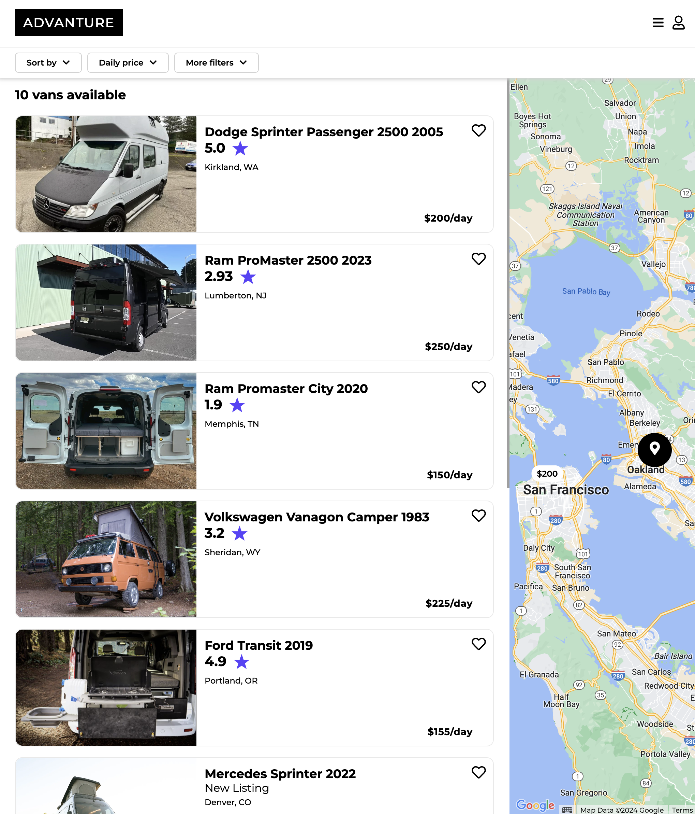
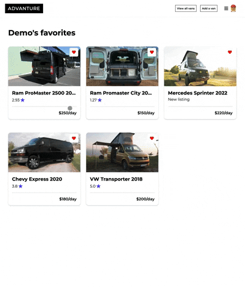
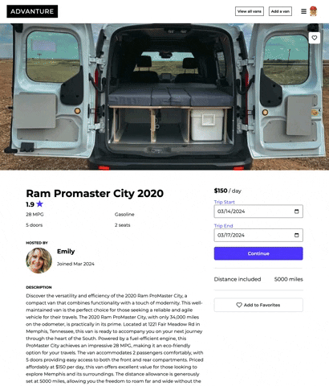

# Advanture
### Link to live site:
https://advanture.onrender.com

### Creator
Chase Agee
[GitHub](https://github.com/thechee) |
[LinkedIn](https://www.linkedin.com/in/chase-agee/)

### Summary
Have an adventure-ready camper van sitting around? Want to get out into nature without having to worry about accomodations? Advanture is the answer, a website dedicated to connecting people looking to rent camper vans and those who have vans!

This is a capstone project for the appAcademy 24-week program.

#### Home Page


#### Van List


#### Van Favorites


#### Van Details/Reviews


## Technologies
#### Languages


#### Frameworks/Libraries


#### Database


#### APIs and Services


#### Development Tools


#### Hosting


## Getting started

1. Clone this repository (only the main branch for full functionality).

2. Install dependencies.

   ```bash
   pipenv install -r requirements.txt
   ```

3. Create a __.env__ file based on the example with proper settings for your
   development environment.

4. Make sure the SQLite3 database connection URL is in the __.env__ file.

5. This starter organizes all tables inside the `flask_schema` schema, defined
   by the `SCHEMA` environment variable.  Replace the value for
   `SCHEMA` with a unique name, **making sure you use the snake_case
   convention.**

6. Get into your pipenv, migrate your database, seed your database, and run your
   Flask app:

   ```bash
   pipenv shell
   ```

   ```bash
   flask db upgrade
   ```

   ```bash
   flask seed all
   ```

   ```bash
   flask run
   ```

7. To run the React frontend in development:
-`cd` into the __react-vite__ directory and run `npm i` to install dependencies. 
- Next, run `npm run build` to create the `dist` folder. This
   command includes the `--watch` flag. This flag will rebuild the __dist__
   folder whenever you change your code, keeping the production version up to
   date.

## Features
1. Vans
2. Reviews
3. Favorites

### Feature Features
1. Bookings
2. Notifications
3. Search by Location
4. Van Features
